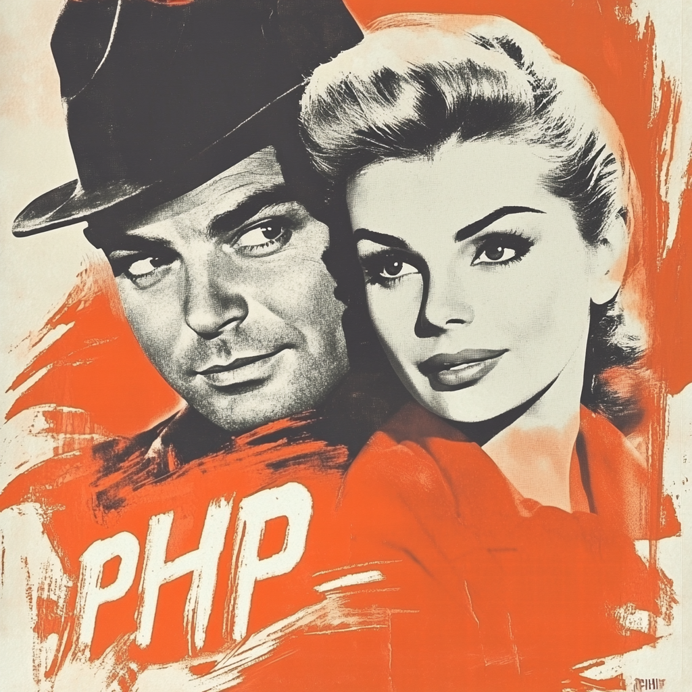

Self: https://github.com/palladius/app-mod-workshop-set-by-step

This contains solutions (spoiler alert!) for the AppMod workshop invented by Riccardo and inspired by a failed
talk on AppMod: "scrap your old app to the Cloud" (*rottama la tua vecchia app verso il Cloud*).

This workshop will be run by Googlers who will provide some entrypoint to GCP (eg, *coupons*).

## folder

* Navigate the `workshop-steps/` folder and scroll the READMEs in alpha order. Each folder has some contextual goodies.

## Prerequisites

* A computer with a browser, connected to the internet.
* Some GCP credits. Ask your local Google aficionado for some ;)
* `gcloud` working.
    * Are you working **local**? download it [here](https://cloud.google.com/sdk/docs/install). You will also need some nice editor (eg `vscode` or ).
    * Want to do everything "**in the Cloud**"? You can use [cloud Shell](https://cloud.google.com/shell/docs) then.
* a **Github user**. You need this to branch the original code [🧑🏻‍💻 gdgpescara/app-mod-workshop](https://github.com/gdgpescara/app-mod-workshop) with your own git repo. This is needed to have your own CI/CD pipeline (one commit -> one build ~> one deploy)
    * For instance: https://github.com/Friends-of-Ricc/app-mod-workshop

**Nice to haves**:

* Install [Cloud Code](https://cloud.google.com/code?hl=it) on your local `vscode` or `JetBrains` IDEs.

## Where to edit your code

I see two possible journeys to enjoy this workshop.

1. [5% of people] If you are a **power user**, you'll enjoy coding locally on `vscode` and install `gcloud`, `mysql`, `php`, and so on. Chances are, you have most of it already installed and of course you have a Linux or a Mac.
2. [**default** 95%] If you are not a CLI abituee, or if you have a Windows machine, you're better off using **Cloud Shell**. This is very easy to use, it's a shell in the cloud with ALL the code you need preinstalled. It's amazing how hands-off this really is. The only  drawback is increased latency as code is not local to your machine. However, the increase of speed for "day 0" and "day 1" dev setups is palpable.

## License

[MIT](https://github.com/palladius/app-mod-workshop-set-by-step/blob/main/LICENSE) - just like original app.

## thanks

* :bowtie: [Gregorio Palamà](https://www.linkedin.com/in/gregorio-palam%C3%A0/) for inspiration and PHP code.
* :bowtie: [Maurizio Ipsale](https://www.linkedin.com/in/maurizioipsale/) and :bowtie: [Mirko Gilioli](https://www.linkedin.com/in/mirko-gilioli/) for having my workshop in GDG Modena.
* :bowtie: [Giacomo Guiduzzi](https://www.linkedin.com/in/giacomo-guiduzzi/) (GH: :octopus: [giacomoguiduzzi](https://github.com/giacomoguiduzzi) ) for help with `Dockerfile` for PHP 5.

