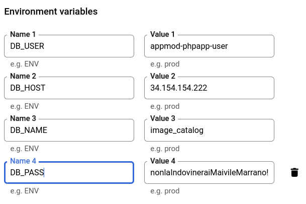
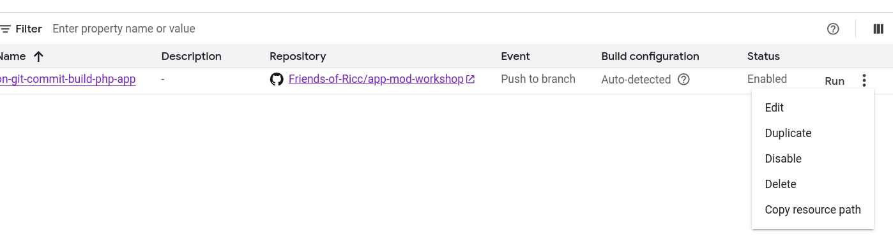

## ENVification

Preparing an app for the cloud is all about extracting pieces of info from the app to the outside world,
and this is normally done (as a first step) with `ENV` variables. This allows you to deploy similar versions
of the same app to different endpoints, with slightly different configurations.

Let's see this with some examples.

## Respect the Environment (TODO(ricc) integra meglio con il 2.5)

It all starts with `ENV`.

ENV is the "**bridge**" between your deployed app and your system to provide those variables.

Example:

From:

```
$db_host = 'localhost'; // or https://1.2.3.4/
$db_name = 'my_awesome_db';
$db_user = 'my_secret_user';
$db_user = 'nonL4Indovin3r4iM41';
```

to:

```php
# TODO(ricc):  obsoleto - vedi 2.5
$db_host = getenv('DB_HOST');
$db_name = getenv('DB_NAME');
$db_user = getenv('DB_USER');
$db_user = getenv('DB_PASS');
```


## Let's get to work!


**1. Create the `.env` file**  TODO(ricc): sposta allo step `00-fork`

Get inspired by local .env.dist and copy it locally.
I made it so you can't easily add to git mistakenly.


## Even better

What about using Secret Manager?

Maybe the secretest of your secrets (in proper English, "deep secrets") can't stand on ENV, you're afraid someone could
steal it. So let's do better. Let's make sure this NEVER makes it anywhere else than Secret Manager.

```
$db_host = getenv('DB_HOST'); // from ENV
$db_name = getenv('DB_NAME'); // from ENV
$db_user = getenv('DB_USER'); // from ENV
$db_user = getenv('DB_PASS'); // Stored and linked to Secret Manager
```

## Secret Manager

* Click on [Secret Manager](https://console.cloud.google.com/security/secret-manager). First time you will be asked to enable the API:

* Now click "Create a secret": Let's call it rationally
   * Name: `php-amarcord-db-pass`
   * Secret value: '*your DB password*' (ignore the "upload file" part).
* annotate this secret link, should look like `projects/839850161816/secrets/php-amarcord-db-pass`. This is the univoque pointer to your secret (For Terraform, Cloud Run, and others).
* Now we need to tell Cloud run how to get this information:
* Finally, clean up your code and remove every essence of DB_PASS. Your code is now clean!

## Tweaking Cloud Run

Cloud run is able to both:

* store ENV variables (of course!), or
* reference Secret Manager (more secure).

As we say in Italy, *learn the art and put it apart*.

It's important to learn both ways so you can choose the one you prefer.

### Our exercise

We want to change Cloud Run from this ENV-only approach:



To this mixed approach:




### Cloud Run script

From a bash perspective, this means changing from:

```bash
gcloud --project "$PROJECT_ID" run deploy \
    php-amarcord-bin \
    --source . \
    --port 80 \
    \
    --set-env-vars DB_PASS="$DB_PASS" \
    --set-env-vars DB_USER="$DB_USER" \
    --set-env-vars DB_HOST="$DB_HOST" \
    --set-env-vars DB_NAME="$DB_NAME" \
    \
    --region europe-west8 \
    --allow-unauthenticated
```

to something like:

```bash
PROJECT_NUMBER="1234567809" # your project number
gcloud --project "$PROJECT_ID" run deploy \
    php-amarcord-bin \
    --source . \
    --port 80 \
    \
    --set-secrets DB_PASS="projects/$PROJECT_NUMBER/secrets/php-amarcord-db-pass" \
    \
    --set-env-vars DB_USER="$DB_USER" \
    --set-env-vars DB_HOST="$DB_HOST" \
    --set-env-vars DB_NAME="$DB_NAME" \
    --set-env-vars APP_NAME="$APP_NAME (built locally from CLI)" \
    --set-env-vars APP_VERSION="${APP_VERSION}-obsolete-cli" \
    \
    --region europe-west8 \
    --allow-unauthenticated
```

TODO(Ricc): magari trasforma in tabella lato a lato.

## Final result

We want to have this on Cloud Run:

