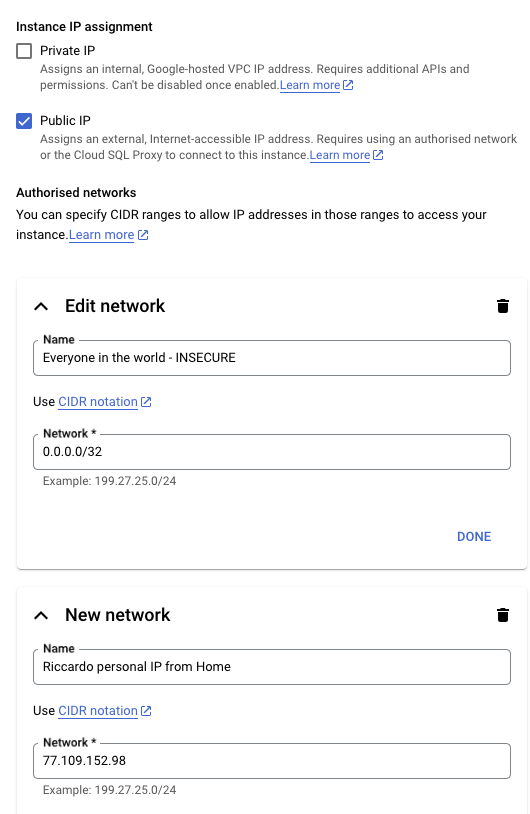

Hey, we need a place where to store the Database in the Cloud!

## Create a SQL Instance (will take ~10min)

1. Make sure you have billing enabled for your project, or you won't be able to create an instance.
2. Go to Cloud SQL page: https://console.cloud.google.com/sql/instances
3. Click "Create Instance"
4. Choose MySQL.
5. Get the cheapest:
    * Edition: `Enterprise`
    * Preset: `development`
    * Mysql Ver: `5.7` (wow, a blast from the past!)
6. Instance id: `appmod-phpapp`
7. Password: whatever you want but remember it as `CLOUDSQL_INSTANCE_PASSWORD`
8. Region: keep the same as you've chose for the rest of the app (eg, Milan = `europe-west-8`)
9. Zonal avail: `Single Zone` (we're saving money for the demo).
10. Additional notes: You might want to disable the flag `Enable deletion protection` since you're just playing with this.
Note: sometimes changing a value could auto-change other values..

## Wait for the Instance to be created

This might take 10min or so.

Time to get a ☕️ coffee, or move to some other pallalel task.

## Create a DB, user and password

Create the DB.

* Open your instance and Click on Databases tab:
* You should be here: https://console.cloud.google.com/sql/instances/appmod-phpapp/databases
* click "Create Database"
* call it `modernized_image_catalog` (the original is `image_catalog`)

Create User(s).

* Now click on `Users` tab: https://console.cloud.google.com/sql/instances/appmod-phpapp/users
* Click "Add user account".
* User: lets create one:
    * Username: `appmod-phpapp-user`
    * Password: Choose something STRONG, click GENERATE - eg `P$Aur)fsVf)skPFQ`
    * Keep "Allow any host (%)".
* click ADD.

## Open the DB to well-known IPs.

Note all DBs in Cloud SQL are born 'isolated'. You need to explicitly set up a network to be accessible *from*.

* Click on your instance
* Click on thr "Networking" tab. You should somewhere near this link: https://console.cloud.google.com/sql/instances/appmod-phpapp/connections/networking
* Click under `Authorised networks`. Now add a subnet. If you a
    * If you're lazy and want it to work INSECURELY but right now, do this:
        * Name: `Everyone in the world - INSECURE`
        * Network: `0.0.0.0/32`
    * If you want it to be more secure:
        * Find your IP address (eg on https://whatismyipaddress.com/ ), say `1.2.3.4`
        * Name: "Riccardo personal IP from Home" (or whichever descriptive label you want)
        * Network: `77.109.152.98/0`
* Click **save**.

You should see something like this:




## Time to test DB connection!

Note: this will only work if you created the instance, the DB, user, password and you opened the network.
Test the DB connection, with localhost command:

```
$ mysql -u USER -pPASSWORD -H HOST
```

If this doesn't work, check everything done so far!

## Import the Database from codebase

TODO ricc


## Notes on more secure connections

You are currently using a public IP to connect to the Cloud SQL instanece, with additional security of a L3 firewall.

Is this the best way to do it? Is it the only way to do it? Probably no.

There are many other options you might want to check out: https://cloud.google.com/sql/docs/mysql/connect-overview
