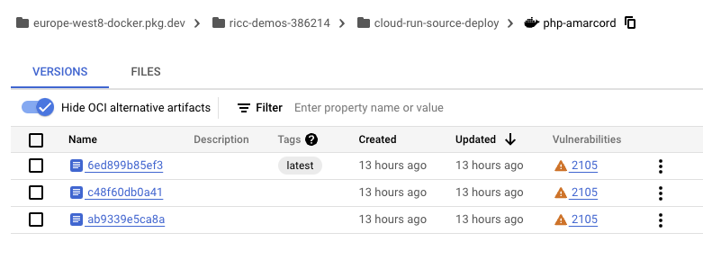
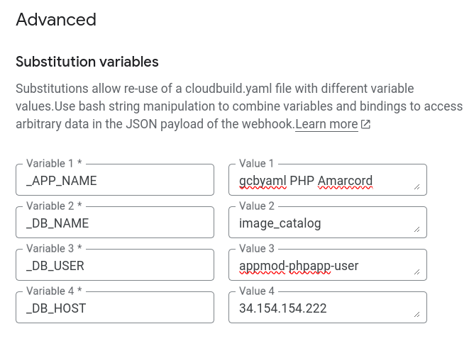
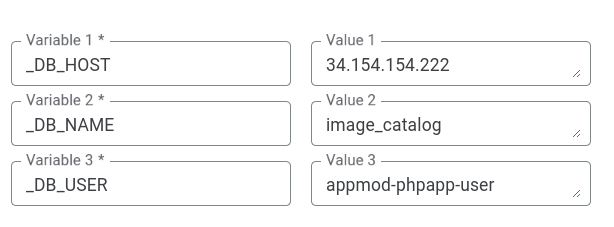
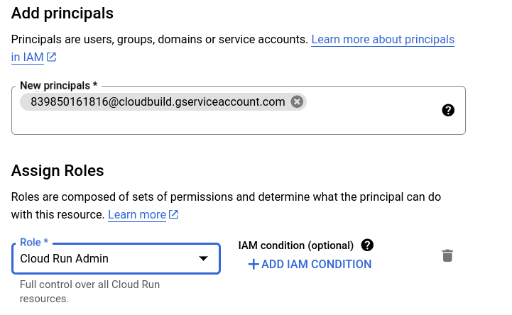
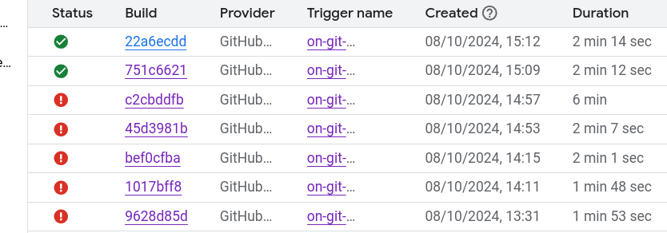

## Why a CI/CD Pipelinet?

By now, you should have typed `gcloud run deploy` a few times, maybe answering the same question over and over again.

Wouldn't it be nice if we could trigger a new build every time you do a new commit/push to your own git repo? To do this we need two things:

1. A personal git repo (luckily, you can fork the )
2. [Cloud Build](https://cloud.google.com/build?hl=en). This amazing and [cheap](https://cloud.google.com/build#pricing) service allows you to configure build automations for pretty much everything: Terraform, dockerized apps, ..

In step 00 you should have already done the part (1) - if not please go back and make sure you have a fork of the repo in this form: https://github.com/<YOUR_GITHUB_USER>/app-mod-workshop.

Here we'll concentrate on part (2) .

## Enter Cloud Build!

We will use Cloud Build to do this:

* build your source (with Dockerfile or BuildPacks). Think of this as a "big .zip file".
* push this "big zip" to Artifact Registry (AR).
* Then issue a deployment from AR to Cloud Run for app "php-amarcord"
    * This will create a new *version* on the existing app (think of a layer with the new code) and we will configure it to divert the traffic to the new version if the push succeeds.

This is an example of some builds for my `php-amarcord` app:


How do we do all of this?
1. By crafting one perfect YAML file: `cloudbuild.yaml`
1. By creating a Cloud Build trigger.
1. By connecting to our github repo through the [Cloud Build UI](https://console.cloud.google.com/cloud-build/builds).


### 1. Create trigger (and Connect Repository)

* go to https://console.cloud.google.com/cloud-build/triggers
* Click "Create Trigger".
* Compile:
     * **Name**: Something meaningful like `on-git-commit-build-php-app`
     * Event: Push to branch
     * Source: "Connect new repository"

     * This will open a window on the right: "Connect repository"
         * **Source provider**: "Github" (first)
         * "Continue"
         * **Authenticate** will open a window on github to cross-authenticate. Follow the flow and be patient. If you have many repos it might take you a while.
         * "Select repo" Select your account/repo and tick the "I understand..." part.

         * Click Connect.
         * Bingo! Your repo is now connected.
     * Back to the Trigger part....
     * Configuration: Autodetected (*)
     * Advanced: leave everything as is.

(*) This is the simplest way. Usually I do the `cloudbuild.yaml` part.

## i've got the power!

Now, the trigger won't work unless you give the **Cloud Build service account** (*what is a service account? The email of a "robot" who acts on your behalf for a task - in this case building stuff in the Cloud!*).

Your SA will fail to build and deploy unless you empower him to do it. Luckily it's easy!

* go to [Settings](https://console.cloud.google.com/cloud-build/settings/service-account).
* Tick these boxes:
    * Cloud Run
    * Secret Manager
    * Service Accounts
    * Cloud Build
* Also tick the "Set as preferred service account"



## Testing the trigger

Now to test the trigger, just commit a very simple change to the PHP repo.

## Riccardo lets see what happens with autodetected...

* Change your app code.
* git commit -a -m 'little change to test Cloud Build'
* git push
* Make sure that this code made it to github..
* Check on your Cloud Build under [history tab](https://console.cloud.google.com/cloud-build/builds):


* **Bingo**! It builds! On success, you see something building something under the name you gave to your trigger.

Click on the build hash to find if the build was successful.

If you click on the `Build Artifacts` you should see that we built a "big zip" and you also find a link on GCR for it (the little arrow on the right of Image):


This is really good, but we can do even better...

## More control with `cloudbuild.yaml` (vecchio)

Now we're able to trigger a build, but we want more control:

* build the artifact
* push a change to Cloud Run (dev)
* [optional] If it all works, push the same change to Cloud Run (prod).

## Per i 🟡🔵 modenesi (Mirko e Maurizio ->  Ⓜ️&Ⓜ️s)

Ragazzi fatemi un piacere. provate a SALTARE la parte di CLONAGGIO. Mi sembra che l'autodetected passi aTUOMATICAMENTE al cloudbuild.yaml quando lo trova.
Provate a seguire i passi di sotto, ma SENZA creare un secondo trigger
eidtemi se il primo magicamente funge.

## YAML YAML guaglio' (ie, more control with `cloudbuild.yaml`)

Let's try to do the same with a more prescriptive multi-stage home-written Cloud Build `YAML` file.

* Copy the previous script, since most stuff will be the same as your first script: Click the 3 dots, then "Duplicate"


* Rename `on-git-commit-build-php-app-1` to `on-git-commit-build-php-app-cbyaml`
* Click EDIT
* Configuration: change from "autodetected" to "Cloud Build configuration file (YAML or JSON)"
* Create or copy from here the `cloudbuild.yaml`
    * TODO ricc quando funge mettilo qui.
    * WIP - for now its here.: `git@github.com:Friends-of-Ricc/app-mod-workshop.git`
* Add variables (note you need to prepend them with a "_"):
     * `_DB_NAME`: Your ENV `DB_NAME`
     * `_DB_USER`: Your ENV `DB_USER`
     * `_DB_HOST`: Your ENV `DB_HOST`
     * What about `DB_PASS`? Great question! You don't need her. She's in the beautiful and secure realm of Secret Manager! By the end of this exercise, you'll wish you'd moved everything to SM!
<!--  -->

* When you've created the trigger, NOw it's time to add the `cloudbuild.yaml` to your code base. If it breaks, no biggie, it never works on first try!
    * If you committed before creating the build trigger, no problem. In this case, go to the https://console.cloud.google.com/cloud-build/triggers page and hit "Run" in the newly created `on-git-commit-build-php-app-cbyaml`.

### Troubleshoot

Usually it takes a while to get CB to work. You need tolearn to check logs and refine the script. Usually the docker complains about a missing ENV or Cloud Run won't start from some reason.

* Between Cloud Run logs and Cloud build logs, you should be able to iterate and fix it.
* this might mean doing micro-commits with a one-line change in `cloudbuild.yaml` , git commit, git push, and observe the changes.
* Yes, this can be frustrating, but it's the price to set up a CI/CD!

####  Permission 'run.services.get' denied error

```
Error "Step #2 - "Deploy to DEV version": ERROR: (gcloud.run.deploy) PERMISSION_DENIED: Permission 'run.services.get' denied on resource 'namespaces/ricc-demos-386214/services/php-amarcord-cb' (or resource may not exist). This command is authenticated as 839850161816@cloudbuild.gserviceaccount.com which is the active account specified by the [core/account] property."
```

* Go to IAM page
* grant access to service account named there: "Cloud Run Admin" (maybe something less is sufficient).



A more sneaky error is this:

```
Step #2 - "Deploy to DEV version": ERROR: (gcloud.run.deploy) [839850161816@cloudbuild.gserviceaccount.com] does not have permission to access namespaces instance [ricc-demos-386214] (or it may not exist): Permission 'iam.serviceaccounts.actAs' denied on service account 839850161816-compute@developer.gserviceaccount.com (or it may not exist). This command is authenticated as 839850161816@cloudbuild.gserviceaccount.com which is the active account specified by the [core/account] property.
```

#### Artifact Repository errors

You might have noticed there's a missing piece here: we did NOT create the Docker-type Artifact Repository, leveraging the existing one created by cloud run for us and called `cloud-run-source-deploy`. This is alike cheating - we shortened this course by re-using an existing one. If for some reason you don't have an existing AR called "cloud-run-source-deploy" in your favorite `GCP_REGION`, chances are the build will fail. In that case, make sure to create one:

* Go to TODO


## Conclusions

If you're lucky you'll get to a point where your red history becomes green:



Feels good, doesn't it!

When you're done, you can now uncomment the "deploy to PROD" part. You'll have the SAME code deployed to prod *after*
successfully being deployed to dev. This is a pretty simple yet meaningful `git commit` -> `dev` -> `prod` promotion,
which ensures that the same code is deployed to two different endpoints which differ only in the ENV side.

Some ideas:

* what if you don't want to deploy to prod on Fridays or Weekends? how would you tweak the `cloudbuild.yaml`?
    * Tip: add a step with a simple bash script..
* What if you want to do something much more complicated for your CI/CD?
    * Tip: Leverage [Cloud Deploy](https://cloud.google.com/deploy?hl=it)

TODO(ricc): add your app CB.yaml here with PROD commented out
