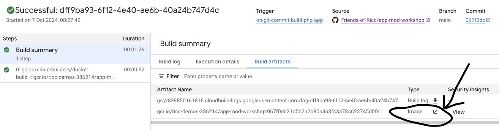

## Why a CI/CD Pipelinet?

By now, you should have typed `gcloud run deploy` a few times, maybe answering the same question over and over again.

Wouldn't it be nice if we could trigger a new build every time you do a new commit/push to your own git repo? To do this we need two things:

1. A personal git repo (luckily, you can fork the )
2. [Cloud Build](https://cloud.google.com/build?hl=en). This amazing and [cheap](https://cloud.google.com/build#pricing) service allows you to configure build automations for pretty much everything: Terraform, dockerized apps, ..

In step 00 you should have already done the part (1) - if not please go back and make sure you have a fork of the repo in this form: https://github.com/<YOUR_GITHUB_USER>/app-mod-workshop.

Here we'll concentrate on part (2) .

## Enter Cloud Build!

We will use Cloud Build to do this:

* build your source (with Dockerfile or BuildPacks). Think of this as a "big .zip file".
* push this "big zip" to Artifact Registry (AR).
* Then issue a deployment from AR to Cloud Run for app "php-amarcord"
    * This will create a new *version* on the existing app (think of a layer with the new code) and we will configure it to divert the traffic to the new version if the push succeeds.

This is an example of some builds for my `php-amarcord` app:

How do we do all of this?
1. By crafting one perfect YAML file: `cloudbuild.yaml`
1. By creating a Cloud Build trigger.
1. By connecting to our github repo through the [Cloud Build UI](https://console.cloud.google.com/cloud-build/builds).

### 1. Create trigger (and Connect Repository)

* go to https://console.cloud.google.com/cloud-build/triggers
* Click "Create Trigger".
* Compile:
     * **Name**: Something meaningful like `on-git-commit-build-php-app`
     * Event: Push to branch
     * Source: "Connect new repository"

     * This will open a window on the right: "Connect repository"
         * **Source provider**: "Github" (first)
         * "Continue"
         * **Authenticate** will open a window on github to cross-authenticate. Follow the flow and be patient. If you have many repos it might take you a while.
         * "Select repo" Select your account/repo and tick the "I understand..." part.

         * Click Connect.
         * Bingo! Your repo is now connected.
     * Back to the Trigger part....
     * Configuration: Autodetected (*)
     * Advanced: leave everything as is.

(*) This is the simplest way. Usually I do the `cloudbuild.yaml` part.

## Testing the trigger

Now to test the trigger, just commit a very simple change to the PHP repo.
## Riccardo lets see what happens with autodetected...

* Change your app code.
* git commit -a -m 'little change to test Cloud Build'
* git push
* Make sure that this code made it to github..
* Check on your Cloud Build under [history tab](https://console.cloud.google.com/cloud-build/builds):

* **Bingo**! It builds! On success, you see something building something under the name you gave to your trigger.

Click on the build hash to find if the build was successful.

If you click on the `Build Artifacts` you should see that we built a "big zip" and you also find a link on GCR for it (the little arrow on the right of Image):

This is really good, but we can do even better...

## More control on cloudbuild.yaml

Now we're able to trigger a build, but we want more control:

* build the artifact
* push a change to Cloud Run (dev)
* [optional] If it all works, push the same change to Cloud Run (prod).
