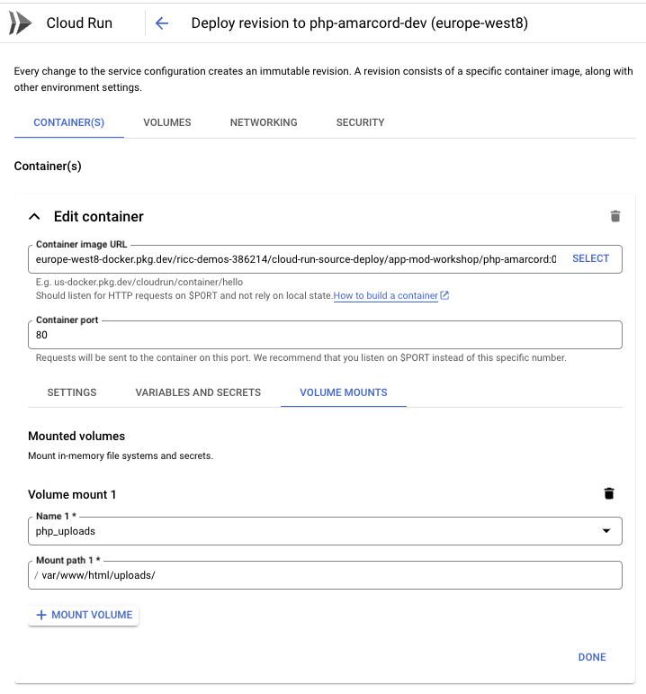
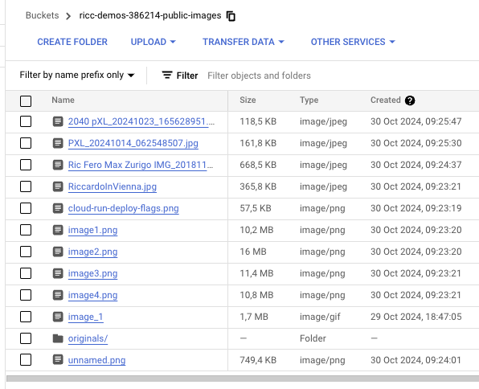

## Storage

Currently the app stored the state in a docker container.
If the machine breaks, the app explodes, or simply if you [push a new revision](https://cloud.google.com/run/docs/deploying#revision), a new will be scheduled, with a reset (=>empty) storage. 🙈

How do we fix it? there are a number of approaches.

1. Store images in the DB. That's what i've ended up doing with my previous PHP app. It's the simplest solution as it doesn't add complexity to it. But it adds latency and load to your DB for sure!

1. Migrate your Cloud Run app to a storage-friendly solution: [GCE + Persistent disk](https://cloud.google.com/persistent-disk?hl=en)? Maybe [GKE + Storage](https://cloud.google.com/kubernetes-engine/docs/concepts/storage-overview)?

1. Move to [GCS](https://cloud.google.com/storage?hl=it). Google Cloud Storage offers best in class Storage for the whole of Google Cloud and it's the most Cloud idiomatic solution. However, it requires us with getting dirty with [PHP libraries](https://github.com/googleapis/google-cloud-php). Do we have [PHP 5.7 libraries for GCS](https://cloud.google.com/php/docs/reference/cloud-storage/latest)? Does `PHP 5.7` even support `Composer` (seems like [PHP 5.3.2 is the earliest version](https://getcomposer.org/doc/00-intro.md) supported by Composer)?

1. Maybe use a [docker sidecar](https://cloud.google.com/run/docs/deploying#sidecars)?

1. Or maybe use GCS [Cloud Run Volume Mounts](https://cloud.google.com/blog/products/serverless/introducing-cloud-run-volume-mounts). This sounds amazing.

<div style="color: magenta">

## 🤔 Migrate storage (open ended)

[Open Ended]
In this exercise, we want you to find a solution to move your images in a way which is persisted in some way.


### Acceptance test

I don't want to tell you the solution, but I want this to happen:

1. You upload `newpic.jpg`. You see it in the app.
2. You upgrade the app to a new version.
3. `newpic.jpg` is still there, visible.

</div>

## 💡 Possible solution (GCS Cloud Run Volume Mounts)

This is a very elegant solution which allows us to achieve stateful file uploads while not touching the code AT ALL (apart from showing an image description, but that's trivial and just for eye satisfaction).

This should allow you to mount a folder from Cloud Run to GCS, so:

1. All uploads to GCS will actually be visible in your app.
1. All uploads to your app will actually be uploaded to GCS
1. Magic will happen tyo objects uploaded in GCS (chapter 7).

**Note**. Please read the FUSE fine print. This is NOT ok if performance is an issue.

### Create a GCS bucket

GCS is the omni-present storage service of Google Cloud. It's battle-tested, and is used by every GCP service needing storage.

```
# Your Cloud Run Service Name, eg php-amarcord-dev
SERVICE_NAME='php-amarcord-dev'
BUCKET="${PROJECT_ID}-public-images"
GS_BUCKET="gs://${BUCKET}"

# Create bucket
gsutil mb -l "$GCP_REGION" -p "$PROJECT_ID" "$GS_BUCKET/"

# Copy original pictures there - better if you add an image of YOURS before.
gsutil cp ./uploads/*.png "$GS_BUCKET/"
```

### Configure CLoud Run to mount the bucket in the /uploads/ folder

Now let's come to the elegant part. We create a volume `php_uploads` and instruct Cloud Run
to do a FUSE mount on `MOUNT_PATH` (something like `/var/www/html/uploads/`):

```
# .. keep variables from previous script..

# Uploads folder within your docker container.
# Tweak it for your app code.
MOUNT_PATH='/var/www/html/uploads/'

# Inject a volume mount to your GCS bucket in the right folder.
gcloud --project "$PROJECT_ID" beta run services update "$SERVICE_NAME" \
    --region $GCP_REGION \
    --execution-environment gen2 \
    --add-volume=name=php_uploads,type=cloud-storage,bucket="$BUCKET"  \
    --add-volume-mount=volume=php_uploads,mount-path="$MOUNT_PATH"
```

If it works, the editing the new Cloud Run revision should show you something like this:



If you have also a PROD instance, you can also run the same script for the prod `SERVICE_NAME`. **Note** this only works if dev and prod hit on the same DB. If you have two different DB confs for dev and prod (and you should!), then you should also have TWO buckets, and prod should mount the second bucket. This is a great follow up exercise.

The images should flow seamlessly on GCS without writing a single line of PHP:



### What just happened?

Something very magical has happened.

An old application with old code is still doing its job.
A new, modernized stack allows us to have all the images/pictures in our app comfortably sitting in a stateful Cloud Bucket. Now the sky is the limit:

* Want to send an email every time an image with "dangerous" or "nude" comes in? You can do that without touching the PHP code.

* Want to use a Gemini Multimodal model every time an image comes in to describe it, and upload the DB with its description? You can do that without touching the PHP code. You don't believe me? Keep reading on in chapter 7.
