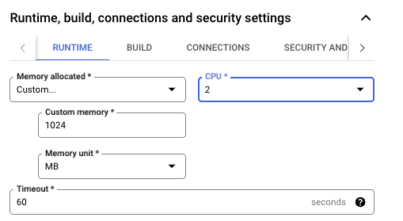

## Open ended ideas

Now you have an awesome modernized, shiny new PHP app (like a 2024 `Fiat 126`) with Cloudified storage.

You have a Gemini API Key you can get from [here](https://ai.google.dev/gemini-api/docs/api-key).

What can you do with it?

## 1. Simple Gemini PHP page [open ended]

Note: to do this exercise you need to use PHP libraries for GCP and write PHP code. Sometimes the libraries do NOT support older versions of PHP.

Libraries (they both require `composer`):
* https://cloud.google.com/php/docs/reference/cloud-ai-platform/latest (**Official Vertex AI**). `composer require google/cloud-ai-platform`
* https://github.com/gemini-api-php/client (non-supported by Google).

What to do:

* Delve into Gemini for PHP docs.
* Learn to install the library in your `Dockerfile`
* create a `gemini.php` page which calls some kind of completion of "Why PHP is still awesome in 2024?".
* test it locally until you get it to work.
* add `GEMINI_API_KEY` to SecretManager
* Deploy a new version to Cluod Run!

## 2. This is too easy! [open ended]

Really?

Well then, for every image in the DB, use Gemini multimodality to ask "what's in the image"?
This could be done contextually to a person uploading a new image, and maybe Gemini could take a guess in that being SFW or NSFW.

Maybe wrap it in a Google Cloud Function. Steps could be like this:

* If you use GCS, make sure to intercept all object CREATION in a certain bucket/folder.
* whenever an object is created there, call this GCF. Note the code can be in PHP or anything else! Use your favorite language for it!
* Exploit Gemini ability to *describe* the image and say if there's something good/bad about it. You could have TWO functions or have a single prompt which enforces a JSON answer (only *python* library allows it ATM, AFAIK) like:

```json
{
    "description": "This is the picture of an arrosticino",
    "suitable": TRUE
}
```
* track the answer back to your application. For instance, you could add a migration to your app to add for an image description, and populate it with Gemini. That would have a great visual effect on your audience!

# Links

* [Gemini and PHP](https://github.com/gemini-api-php/client) - not sure if `composer require gemini-api-php/client` will work with PHP 5.7. Welcome to 1955, Mertin!
* [PHP library for cloud-ai-platform](https://cloud.google.com/php/docs/reference/cloud-ai-platform/latest).


## Possible troubles (IAM / permissions)

1. Note that for deploying a GCF function which listens to a GCS bucket you need to set up proper permissions to the Service Account, as in figure:


You might also have to enable **EventArc APIs**.

2. Another comment from UI for GCF permissioning is this:


3. The logs could say: "'Memory limit of 244 MiB exceeded with 270 MiB used. Consider increasing the memory limit, see https://cloud.google.com/functions/docs/configuring/memory'". Again, add RAM to your GCF.
Here's a poissible bump:


