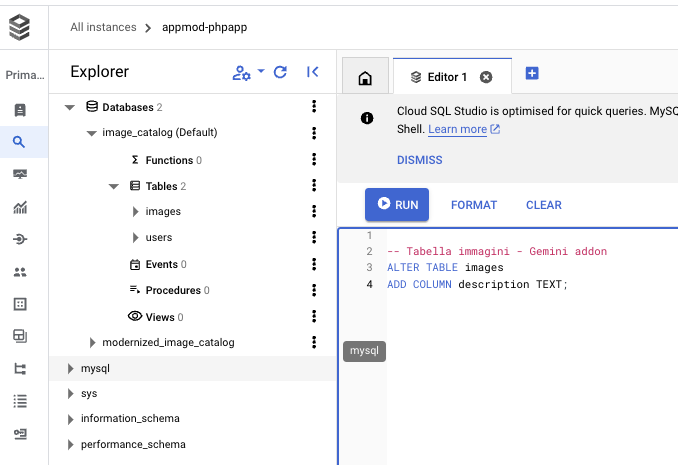

In chapter 70 (Ricc - maybe we remove it / refactor it!)

## Set up a Cloud function (in python)


## Patch the db

1. Open Cloud SQL Studio:


2. Put your user and password for the Images DB
3. Inject this SQL which adds a column for an image descripton:

```sql
-- Images table - Adding a description textual field for Gemini to populate it
ALTER TABLE images
ADD COLUMN description TEXT;
```



And bingo! Try now to check if it worked:

```sql
SELECT * FROM images;
```

You should see the new description column:


## Write the Gemini GCF

I've actually asked Gemini to write it for me, then I changed a few things.

A possible code:

```python
TODO(ricc): wuando va
```
