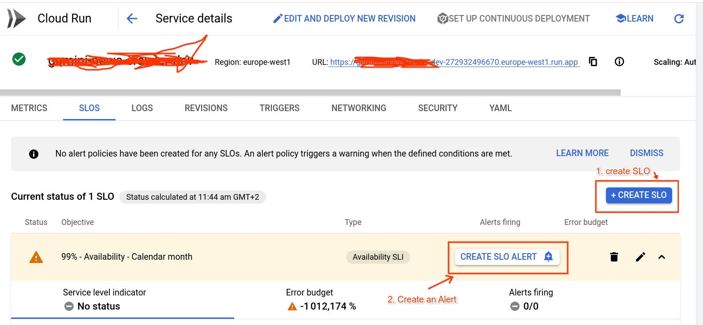

In the Chapter we try to achieve this:

1. Creating SLIs
1. Creating SLOs based on the SLIs
1. Creating Alerts based on SLOs

This is a very dear topic to me, since I (Riccardo) work in the SRE / DevOps area of Google Cloud.

## (open-ended) Create SLIs and SLOs for this app

How good is an app if you can't tell when it's down?

### What is an SLO?

Oh my! Google invented SLOs! To read more about it I can suggest:

* [SRE Book - chapter 2 - Implementing SLOs](https://sre.google/workbook/implementing-slos/). ([👉 more SREbooks](https://sre.google/books/))
* [Art of SLOs](https://sre.google/resources/practices-and-processes/art-of-slos/) (**[awesome video](https://www.youtube.com/watch?v=E3ReKuJ8ewA)**). It's a fantastic training to learn more about how to craft a perfect SLO for your service.
* [SRE **course** on Coursera](https://www.coursera.org/learn/site-reliability-engineering-slos). I contributed to it!

### Step 1: Create Availability SLI/SLO

Let's start with Availability SLO, as it's the easiest and possibly the most important thing you want to measure.

Luckily Cloud run comes with pre built SLO support through Istio & friends.

* https://cloud.google.com/stackdriver/docs/solutions/slo-monitoring/ui/create-slo

Once your app is on Cloud run, this is super simple to achieve, it takes me 30 seconds.

* Go to your Cloud Run page.
* Click/select your app.
* Select the `SLOs` tab.
* Click "+ Create SLO".
    * Availability, Request-based
    * Continue
    * Calendar Month / 99%.
    * click "Create SLO".




### Step 2: set up Alerting on this SLO

I suggest to create 2 alerts:

1. One with a low burnrate ("Slowburn") to alert you via email (simulates low pri ticket).
1. One with a high burnrate ("Fastburn") to alert you via SMS (simulates high pri ticket / pager)

Go to your `SLO tab` from before.

Do this twice:

* Click "Create SLO Alert".
* Lookback duration, Burn Rate threshold:
     * [FAST]. First: `60` min / `10` x
     * [SLOW]. Second: `720` min  / `2` x
* Notification channel: click on Manage notification channels
    * First, "Email" -> Add new -> ..
    * Second, "SMS" -> Add new -> Verify on the phone.
    * Tip: I like to use emoji in the names! It's fun for demos.
* when done, click the big X on top right.
    * Select phone first (fast), email next (slow).
* Add some sample documentation like:
    * ```[PHP Amarcord] Riccardo told me to type sudo reboot or to check documentation in http://example.com/playbooks/1.php but I guess he was joking```.

Bingo!

## Final result

We can consider this exercise finished once you have a working SLI, SLO and alerting for your availablity,
and it's alerting to your email and to your phone.
