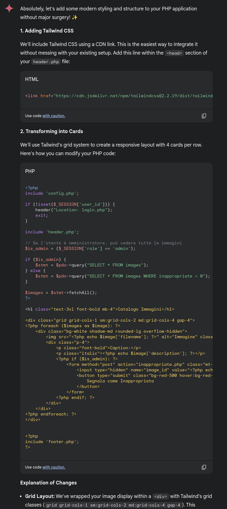
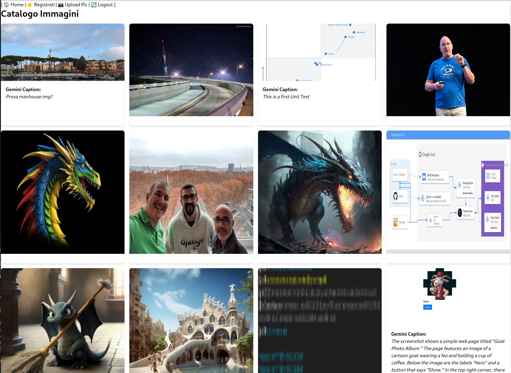

You've completed EVERYTHING, what's missing?

Some food for thought:

## Play with Gemini

You can use Gemini in two flavours:

1. The "Enterprise way", intertwined with your GCP, which we've explored in chapter 7 (GCF+Gemini). All authentication magically works, and services beautifully interconnect.

2. The "Consumer way". You get a Gemini API Key from [here](https://ai.google.dev/gemini-api/docs/api-key) and start building little scripts which can be tied onto any workload you already have (proprietary work, other clouds, localhost, ..). You just substitute your API key and the code starts magically to work.

We encourage you to try exploring the (2) with your own pet projects.

## UI Lifting

I'm no good at UIs. But Gemini is! You can just take a single PHP page, and say something like this:

```
I have  VERY old PHP application. I want to touch it as little as possible. Can you help me:

1. add some nice CSS to it, a single static include for tailwind or similar, whatever you prefer
2. Transform the image print with description into cards, which fit 4 per line in the canvas?

Here's the code:

-----------------------------------
[Paste your PHP page, for instance index.php - mind the token limit!]
```

You can easily get this in less than 5 minutes, one Cloud Build away! :)

The response from Gemini was perfect (meaning, I didnt have to change a thing):



And here's the new layout in Riccardo personal app:



Note: the code is pasted as image as we aren't here in the HTML/CSS business. The point is, Gemini can change the code for you and you're left with very minor changes.

## Security

To secure the app, this is a different chapter entirely, check out the `SECURITY.md`
