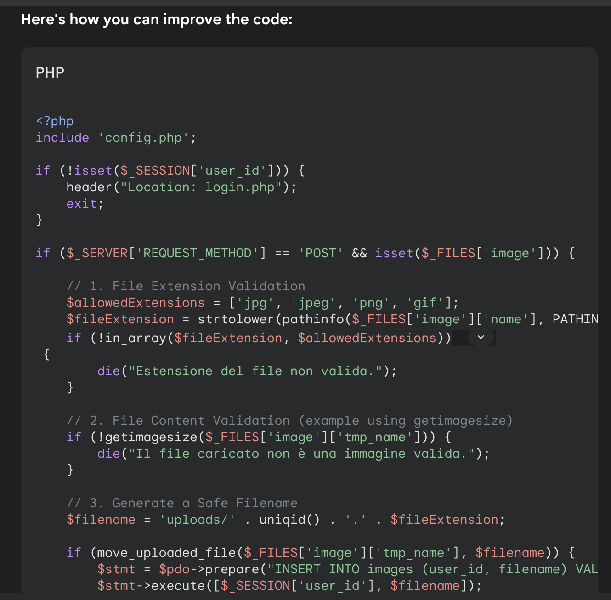

This chapter wants to sparkle ideas for further improvements.

# 🛡️ Security

Security is a long journey. If it takes you **4 hours** to move your old app to a decent-enough
low-security-bar app to the Cloud, it will probably take you **40-80h** to fully secure it.

## IAP

Want to prevent unauthorized access from unintended people?

[Set up IAP](https://cloud.google.com/security/products/iap?hl=en) to control who accesses your app (maybe only people from XXX@my-php-app.com).

## Custom Service Account + IAM

To keep things easy, we used a single and powerful Service Account (the `compute` default one). However, you don't want to have a single account able to do everything. To decrease the blast radius, better to have different accounts.

* create ad-hoc Service Account (eg `app-runnner@...`, `gcs-writer@...`, `app-builder@..` ).
* Set up strict, minimal IAM access for each SA.

## DB hardening

Do what's needed to disable Cloud SQL public IP (you'll sleep tighter sleeps after).

Possible solutions:

* set up proxy
* use the connector

Note: some info is already in the 01 README.

## 🏞️ App Hardening

The app has currently a number of vulnerabilities. While it's not part of the workshop to fix them, it's important to be aware they exist.

### Upload vulnerability

The app is currently vulnerable to Code Injection as beautifully demonstrated by Davide Guerri who reached out to me offering my personal `DB_PASS` (true story!).

You can upload a PHP file which allows generic PHP code execution. This is dangerous!

A possible fix is here: https://github.com/Friends-of-Ricc/app-mod-workshop/pull/2

Another way is to ask Gemini! you can try these simple steps:

* Go to https://gemini.google.com/
* Use a prompt like this:

```
You are a helpful code vulnerability scanner. This file is part of a PHP web app. Do you see any vulnerabilities in this code?

---

Paste the code of `upload.php` here..

```

Gemini identified some vulnerabilities (Missing File Extension Validation, Missing File Extension Validation, Unrestricted File Name, ..) and also proposed a good solution fixing filename, random id, and so on.



Security code reviews can even be automated, having workflows sending PRs to fix high-severity vulnerabilities. 

Another futuristic solution might be to change the code in module 7 to have a Cloud function which inspects the content, decides if it's good or bad, and based on this 50/50 output puts the image under a locked down `quarantine/` folder with `700` permissions. If you don't want to be vulnerable for these 4-5 seconds for the GCF to run and decide, you could even refactor the code to move the image to `/accepted/` vs `/quarantined/`, de facto guaranteeing that an image is visualized only after the AI has accepted it.

Scanning of uploaded content could happen through automated tools, including static code analysis and malware analisys (e.g., [Virustotal](https://cloud.google.com/chronicle/docs/soar/marketplace-integrations/virustotal)) to catch more sophisticated attacks.
